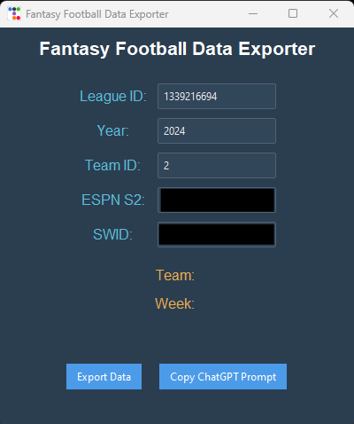

```markdown
# Fantasy Football League Data Exporter



This Python script connects to your ESPN Fantasy Football league, exports all relevant data about your team, matchups, players, free agents, and recent activity, and generates a detailed prompt to ask GPT for recommendations on how to improve your team. The script features a modern graphical user interface (GUI) that allows users to easily input their league information and export data with a click.

## Features

- Modern graphical user interface (GUI) built with `ttkbootstrap`, featuring stylish buttons, labels, and automatic data input fields.
- Exports your team's data, including player performance, matchups, and standings.
- Retrieves free agent information for potential roster improvements.
- Exports recent league activity such as trades and waiver wire actions.
- Copies a detailed prompt to your clipboard for use with GPT, enabling AI-driven recommendations for managing your fantasy football team.
- Saves data in JSON format for easy analysis.

## Installation

### Step 1: Clone the Repository
Clone this repository to your local machine:
```bash
git clone https://github.com/jmukobi/fantasy_football.git
cd fantasy_football
```

### Step 2: Install Required Packages
You’ll need to install several Python packages to run the script, including `ttkbootstrap` for the GUI. You can install them with the following command:
```bash
pip install -r requirements.txt
```

If you don't have a `requirements.txt` file, here’s a list of the required packages:
```bash
pip install ttkbootstrap espn_api pyperclip
```

### Step 3: Set Up `secrets.py`
The script requires your ESPN Fantasy Football cookies (`espn_s2` and `swid`) to authenticate with your private league. You can set these up in a `secrets.py` file.

1. Copy `secrets_example.py` to `secrets.py`:
   ```bash
   cp secrets_example.py secrets.py
   ```

2. Open `secrets.py` and replace the placeholder values with your actual `espn_s2` and `swid` cookie values. Here’s an example of what it should look like:
   ```python
   espn_s2 = "YOUR_ESPN_S2_COOKIE"
   SWID = "YOUR_SWID_COOKIE"
   ```

   You can find these cookie values by logging into ESPN Fantasy Football, opening the Developer Tools in your browser (usually by pressing F12), and looking under the "Application" tab for the cookies.

## Running the Script

Once you've installed the required packages and set up your `secrets.py`, you can run the script as follows:

```bash
python main.py
```

The script will:
1. Launch a modern GUI where you can input your league details or prefilled data.
2. Connect to your ESPN Fantasy Football league using the credentials from `secrets.py`.
3. Export data such as your team’s performance, player stats, matchups, free agents, and recent activity into a JSON file.
4. Copy a detailed prompt to your clipboard to ask GPT for recommendations on how to manage your team.

### GUI Features

- **Automatic Field Prefilling**: If you've set up your `secrets.py` file, the ESPN S2 and SWID fields will automatically populate in the GUI.
- **User-Friendly Interface**: Input your league ID, year, and team ID directly in the GUI and export your data with a single click.
- **Stylish Buttons**: The interface includes large, bolded, and rounded buttons for easy interaction.
- **Status Messages**: The status label updates dynamically to inform you whether data was exported successfully or if an error occurred.

### Output Files
- The exported data will be saved in the `data_exports` folder in JSON format, named as `league_data_week_{week}_{timestamp}.json`.
- A file called `prompt.txt` is included with the same GPT prompt that is copied to your clipboard.

## How to Use the GPT Prompt

After running the script, the prompt for GPT will be copied to your clipboard. You can also find it in `prompt.txt`.

The prompt provides GPT with all the necessary context to analyze your fantasy football team and give you recommendations for lineup changes, trades, and other strategies.

Make sure **not** to share your `secrets.py` file on GitHub or with others, as it contains sensitive information.

## Dependencies

- `ttkbootstrap`: Provides a modern, stylish look for the GUI. Install via `pip install ttkbootstrap`.
- `espn-api`: To interact with ESPN’s fantasy football API. Install via `pip install espn-api`.
- `pyperclip`: Used to copy text to the clipboard. Install via `pip install pyperclip`.

You can install all required dependencies by running:
```bash
pip install -r requirements.txt
```

## Contributing

Feel free to submit issues or pull requests if you would like to contribute to the project. Any improvements, suggestions, or bug fixes are welcome!
```